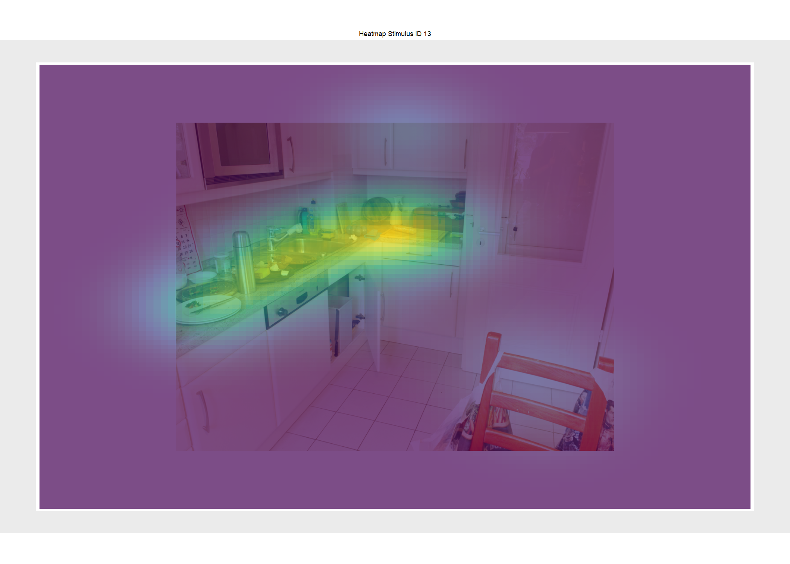

EyEdu - A Basic Eye Movement Analysis Package for Educational Purposes
================

### Disclaimer

EyEdu (pronounced "I do!") is not intended to replace existing or commercial software packages for the analysis of eye-tracking data. The development of eyEdu was motivated by the idea that teaching the basics of eye-tracking (e.g., in workshops for undergraduate students) should be as hands-on as possible. With cheap hardware ([EyeTribe](http://theeyetribe.com/theeyetribe.com/about/index.html) - or whatever alternative might hopefully come up soon) and open source software ([R](https://www.r-project.org/), [OpenSesame](https://osdoc.cogsci.nl/), [PyGaze](http://www.pygaze.org/)) available, practically every student can create experiments, collect data and run analyses on her/his own.
The package provides basic functions to import raw eye-tracking data (currently only for EyeTribe), to visualize data, to conduct fixation detection, to create or import area of interest definitions and [several additional functions](#list-of-functions).
Example experiments including real eye movement data can be downloaded and used to run some first analyses (aka playing around). This package is obviously incomplete, full of bugs and might change a lot in the future. If you think that you can make it better, join the team!

### November 2022 +++ NEW +++ NEW +++ NEW +++ NEW +++

Several new features for the analysis of pupil dilatation data have been added to eyEdu.

A new function that sets the onset of the time variable to 0 for the start of each trial or period of interest

``` r
EyEduAdjustTiming() 

```

Pupil data are often full of artefacts. Blinks and other forms of missing data (e.g., tracker loss) introduce a lot of noise. *EyEduPupilPreproc()* attempts to identify and to remove these artefacts if possible by interpolating time windows without data and by applying a filter. There are several arguments that should be set carefully.  

+ **regression.basis** number of time points before and after a blink that will be used to calculate a loess regression model to interpolate missing data   

+ **patch.before** blink onsets usually come with a small increase in pupil size that might distort the interpolation, patch.before defines the number of samples that will be removed before the actual onset   

+ **patch.after** same as patch before only for the blink offset  

+ **filt.win.length** filtering or rather smoothing is conducted using a moving average, so the length of this window defines alters the degree of "smoothness", the longer the window the smoother the data, must be an odd number!   

+ **mov.win** some blinks (or rather periods of data loss) are so short that they do not reach a pupil size level of 0. These spikes are detected using a moving window approach that tests basically for every single sample and, for instance, four samples ahead (i.e., mov.win = 4) whether the sum of values is higher than a threshold value defined via **threshold.var***  

+ **threshold.var** value for pupil size change that indicates a steep decrease (i.e., blink onset) or  steep increase in pupil size (i.e., blink offset)   

+ **span.var** Interpolation is achieved through a loess regression model. The **span.var** ranging between 0 and 1 is (at least for me) not trivial. Here a link to some background information on [loess regressions](https://www.statsdirect.com/help/nonparametric_methods/loess.htm).

``` r
EyEduPupilPreproc(regression.basis = 100,
                  patch.before = 40,
                  patch.after = 40,
                  filt.win.length = 37, 
                  mov.win = 4, 
                  threshold.var = 400,
                  span.var = 0.7)
```
Obviously, you should check whether preprocessing created some meaningful results by comparing the raw pupil data with interpolated and filtered data. For this purpose, eyEdu has another shinyApp. The argument **scale.var** defines how large the plots are rendered. If you are working on a large monitor try 1.5, on a smaller laptop screen try 0.6. 

``` r
EyEduPupilViewer(scale.var = 1.3)

```


There are several ways to compute baseline adjustment. Currently, eyEdu provides two measures, that is, **relative change to baseline** and **percentage change**. The function *EyEduPupilBaseline()* has the following arguments:  

+ **poi.choice** defines for which period of interest baseline adjustment should be computed  

+ **data.type** which type of data should be used, options are "raw", "interpolated", and "filtered"   

+ **baseline.width** the number of samples before the onset of the poi that serves as the baseline

``` r
EyEduPupilBaseline(poi.choice = "anticipate",
                   data.type = "interpolated",
                   baseline.width = 200)
```

Currently, there are three measures that represent the impact of artefacts in various forms. These are written into the *eyEdu.data* format. The variable *poi.bink.count* provides information on how many blinks where in the poi (+ baseline) and *poi.max.blink.length* indicates whether blinks were especially short or long. On a more general noise indicator is the number of zero values in the poi (+ baseline.var) *poi.sum.zeros*. Finally, the information for which poi the impact of noise has been estimated can be found in the variable *poi.noise*.

``` r 
EyEduPupilNoiseEstimate(poi.var = "anticipate", 
                        baseline.var = 200) 
```


### September 2021 +++ NEW +++ NEW +++ NEW +++ NEW +++

Although rather experimental, eyEdu can now also import and visualize data collected with SR-Research EyeLink equipment.  
Just look, how smooth the raw data are. How beautiful fixations were detected. I really like low-cost eye-tracker, but the EyeLinks are another league. ♡


EyeLink example data can be downloaded using:

``` r
EyEduGetExamples(experiment.type = "readEyeLink")

```

A function is added that makes file conversion (EyeLink's edf to ascii files) convenient. 

``` r
EyEduEdf2asc(app.path = ...,
				edf.path = ...,
				asc.path = ...,
				add.options = ...)

# Documentation for this function can be called via
?EyEduEdf2asc()

```

Trial plots (single plots and the Shiny App) can - currently only for EyeLink data - visualize periods of interest.


### April 2021 +++ NEW +++ NEW +++ NEW +++ NEW +++

DiagnosticViewer is a shiny app that allows browsing through diagnostic plots.

``` r
EyEduDiagnosticViewer()

```


### March 2021 +++ NEW +++ NEW +++ NEW +++ NEW +++

EyEdu has now a plot function for heat maps, that is, you can combine the fixation data of several participants (or only one) looking at the same stimulus by providing a list of participant numbers or names. 

``` r
EyEduPlotHeat(participant.nr.list = c(1,2,3,4,5), trial.id = 13, alpha.var = 0.7)

### OR

EyEduPlotHeat(participant.name.list = c("Danvers", "Jones", "Parker", "Prince"),
              trial.id = 13,
              alpha.var = 0.7)

```


### Table of content

-   [Installing eyEdu on your computer](#installing-eyedu-on-your-computer)
-   [Examples for reading experiment](#examples-for-reading-experiment)
    -   [Trial plots reading](#trial-plots-reading)
    -   [Diagnostic plots](#diagnostic-plots)
    -   [Area of interest definitions](#area-of-interest-definitions)
    -   [Getting statistics for fixations and areas of interest](#getting-statistics-for-fixations-and-areas-of-interest)
-   [Examples for scene perception experiment](#examples-for-scene-perception-experiment)
    -   [Trial plots scene](#trial-plots-scene)
    -   [Free-hand rectangular area of interest definition](#free-hand-rectangular-area-of-interest-definition)
-   [List of functions](#list-of-functions)
    -   [Downloading example data](#downloading-example-data)
    -   [Importing raw data](#importing-raw-data)
    -   [Low pass filtering](#low-pass-filtering)
    -   [Fixation detection](#fixation-detection)
    -   [Free-hand drawing of areas of interest](#free-hand-drawing-of-areas-of-interest)
    -   [Importing pre-defined areas of interest files](#importing-pre-defined-areas-of-interest-files)
    -   [Automatic definition for areas of interest around words](#automatic-definition-for-areas-of-interest-around-words)
    -   [Exporting aois to text files](#exporting-aois-to-text-files)
    -   [Importing word aoi labels](#importing-word-aoi-labels)
    -   [Trial plots](#trial-plots)
    -   [Diagnostic plots](#diagnostic-plots-1)
    -   [Batch plot trials](#batch-plot-trials)
    -   [Batch plot diagnostics](#batch-plot-diagnostics)
    -   [Assigning fixations to areas of interest](#assigning-fixations-to-areas-of-interest)
    -   [Getting a fixation summary](#getting-a-fixation-summary)

Installing eyEdu on your computer
---------------------------------

EyEdu is not on CRAN, but the development version can be installed from GitHub using the devtools package. To set up eyEdu, copy this bit of code and run in in R Studio:

``` r
  if (!require("devtools")) {
  install.packages("devtools", dependencies = TRUE)}
  devtools::install_github("SebastianKorinth/eyEdu") 
```
You might get the warning that you have to install Rtools, which is a software that builts binaries for your operating system.
For Windows, for example, please go to http://cran.r-project.org/bin/windows/Rtools/, where you can download and install Rtools.

``` r
 library(eyEdu)
```
Linux users: Installing the devtools package is a bit more challenging. You might try the guide provided here:
https://www.digitalocean.com/community/tutorials/how-to-install-r-packages-using-devtools-on-ubuntu-18-04


Examples for reading experiment
-------------------------------

### Trial plots reading

The plot functions allow to show, to hide or to adjust the color for several eye-tracking parameters (right and left eye, fixations, filtered raw data etc.)

``` r
EyEduPlotTrial(participant.name = "Rosa", 
               trial.nr = 1,
               fix.color = "red",
               show.filtered = FALSE,
               sample.color.r = NA,
               sample.color.l = NA,
               sample.color = "blueviolet")
```


### Diagnostic plots

In order to check the quality of fixation detection in reading experiments - in which the primary movement direction would be on a horizontal line - it is informative to plot the x-position of raw data samples (black line) over a short period of time (e.g., 2500 ms) superimposed by grey shaded areas indicating periods defined as fixations.

``` r
EyEduPlotDiagnostics(participant.name = "Rosa",
                     trial.nr = 1,
                     sample.length = 2500, 
                     show.filtered = TRUE)
```


### Area of interest definitions

There are several ways we can define areas of interest (aoi):
a) We might predefine them (i.e., x-y-positions of upper left and lower right corner) and save them in text files. These files can then be imported into the *eyEdu\_data.Rda* file using the [EyEduImportAoIs() function](#importing-pre-defined-areas-of-interest-files)
b) We might draw them free-hand using the [EyEduShinyAoiRectangle() function](#free-hand-drawing-of-areas-of-interest) and import these files into the *eyEdu\_data.Rda* file using the [EyEduImportAoIs() function](#importing-pre-defined-areas-of-interest-files)
c) Or, we might use some magic. The plot below shows the results of the automatic routine implemented in eyEdu that searches for areas of interest around words called [EyEduDefineWordAois()](#automatic-definition-for-areas-of-interest-around-words)


### Getting statistics for fixations and areas of interest

So if we run [fixation detection](#fixation-detection) and define areas of interest using one of the [three options](#area-of-interest-definitions) and maybe also [add some labels to our word aois](#importing-word-aoi-labels) we'll get nice summaries about, which words were fixatated for how often and for how long.

| aoi.label   |  fix.duration|  fix.pos.x|  fix.pos.y|  fixation.index|  trial.index| stimulus.id |
|:------------|-------------:|----------:|----------:|---------------:|------------:|:------------|
| Although    |           250|   110.9472|   508.2146|               1|            1| 5           |
| Although    |           217|   156.0987|   500.5355|               2|            1| 5           |
| Although    |           199|   136.9149|   516.3870|               3|            1| 5           |
| Although    |           416|   138.1482|   511.3717|               4|            1| 5           |
| I           |           316|   202.2452|   512.7392|               5|            1| 5           |
| really      |           133|   262.2427|   512.8373|               6|            1| 5           |
| Although    |           200|   156.3023|   516.0087|               7|            1| 5           |
| really      |           184|   226.8766|   511.5661|               8|            1| 5           |
| NA          |           166|   291.2547|   512.1679|               9|            1| 5           |
| hated       |           199|   350.0094|   516.4874|              10|            1| 5           |
| mathematics |           234|   416.4178|   510.0621|              11|            1| 5           |
| in          |           216|   517.4159|   510.5837|              12|            1| 5           |
| became      |           200|   638.4027|   515.6502|              13|            1| 5           |
| decent      |           183|   755.2209|   505.0073|              14|            1| 5           |
| NA          |           133|   730.9476|   526.6870|              15|            1| 5           |

### Examples for scene perception experiment

### Trial plots scene

``` r
EyEduPlotTrial(participant.nr = 2, 
               trial.nr = 1,
               fix.color = "green",
               show.filtered = FALSE,
               sample.color.r = "red", # Red for right eye
               sample.color.l = "blue", # bLue for left eye
               sample.color = NA)
```


### Free-hand rectangular area of interest definition

Especially for scene perception experiments the free-hand drawing of aoi might come in handy. Below a screenshot of the [shiny app](https://github.com/SebastianKorinth/ShinyAoEyeR/):


List of functions:
------------------

### Downloading example data

``` r
EyEduGetExamples() 
# Example 
EyEduGetExamples(experiment.type = "reading") 
```

EyEduGetExamples() is a convenience function to download example data and experiments created with [OpenSesame](https://osdoc.cogsci.nl/) and the [PyGaze plugin](http://www.pygaze.org/). They might serve as templates for your own experiment. Currently, there are only two options available to set for the argument *experiment.type*, which is either *"reading"* or *"search"* (scene perception). The function will download the experiment and data into your current working directory.

### Importing raw data

``` r
EyEduImportEyetribeData() 
EyEduImportGazepointData()
# Example
EyEduImportEyetribeData(poi.start = "start_trial", 
                   poi.end = "response_time_key_finish_reading")
```

EyEduImportEyetribeData() imports raw data, that is, tsv-files recorded using a setup of [EyeTribe](http://theeyetribe.com/theeyetribe.com/about/index.html), [OpenSesame](https://osdoc.cogsci.nl/) and [PyGaze](http://www.pygaze.org/). The functions reads the files for all participants, separates eye movement data from message information, extracts relevant information (e.g., screen dimensions, sample rate etc.) and adds this to one structured file called eyEdu\_data.Rda, which is saved in the same folder as the raw data.
Currently, there are two arguments that can be changed, that is, *poi.start* and *poi.end*. Both arguments denote the messages setting the limits for periods of interest (poi). The default setting - leaving these arguments undefined - is "start\_trial" and "stop\_trial", which imports complete trials.
EyEduImportGazepointData() provides the same function for data collected using a [GazePoint](https://www.gazept.com/) setup.

*Note*: The variable raw.data.path pointing to the folder containing the raw data must currently be defined BEFORE calling the import function:

``` r
# Example path definition to raw example data downloaded into the current working directory
raw.data.path <- paste(getwd(),"/exampleDataSearchExperiment-master/", sep = "")
```

### Low pass filtering

``` r
EyEduLowPassFilter()
# Example 
EyEduLowPassFilter(filter.settings = (rep(1/3, 3))
```

EyEduLowPassFilter(): The idea to low-pass filter data that were recorded with a very low sampling rate (max. 60 Hz with EyeTribe) might sound superfluous. However, carefully applied, it might - for very noisy data - improve the chances to run a meaningful fixation detection. The default *filter.settings* are set to a moving average over three samples *(rep(1/3, 3)*, but can obviously be changed.

### Fixation detection

``` r
EyEduDetectFixationsIDT()
# Example
EyEduDetectFixationsIDT(dispersion.var = 90,
                        duration.var = 6,
                        use.filtered = FALSE,
                        participant.list = c("Rosa", "Friedrich"))
```

EyEduDetectFixationsIDT() uses the [emov package](https://cran.r-project.org/web/packages/emov/README.html) by Simon Schwab and the I-DT algorithm (Salvucci & Goldberg, 2000), which uses dispersion limits to distinguish between fixations and saccades. The following arguments must be provided:
- *dispersion.var* = maximal dispersion allowed (in pixels)
- *duration.var* = minimal fixation duration allowed in number of samples, e.g., 6 samples at 60 Hz results in 6 x 16.67 ms = 100 ms)

Optional arguments are, whether fixation detection should be run on raw (default) or on [low-pass-filtered data](#low-pass-filtering)
- *use.filtered* = TRUE or FALSE

And whether fixation detection - with a given set of parameters (for dispersion, duration and filtering), should be conducted for all participants (default) or just a subset defined in a
- *participant.list* (either participant names or numbers)

### Free-hand drawing of areas of interest

Alternatively see the stand-alone app [ShinyAoEyeR](https://github.com/SebastianKorinth/ShinyAoEyeR/)

``` r
scale.var <- 0.66
EyEduShinyAoiRectangle()
```

EyEduShinyAoiRectangle() starts a shiny app that lets you choose trial images from a drop-down list. For each image, you can draw free-hand rectangular areas of interest, give them a aoi-label and save this set of aois to text files that can then be imported into the eyEdu\_data.Rda data file using the function [EyEduImportAoIs()](#importing-pre-defined-areas-of-interest-files). The variable *scale.var* defines the relative size at which the trial image will be shown in the app. With *scale.var = 1* the image will be presented at its original size and resolution, which might be too large for some monitors.

### Importing pre-defined areas of interest files

``` r
EyEduImportAoIs()
# Example
EyEduImportAoIs(append.aois = FALSE,
                delete.existing.aois = TRUE ,
                screen.align.x = 1024,
                screen.align.y = 768)
```

EyEduImportAoIs() imports text files with pre-defined aoi definitions (x and y positions of the upper left and the lower right corner as well as aoi labels) that should be stored in a folder called "aoiFiles" within the raw data path. The following arguments can be set:
- *append.aois = TRUE or FALSE* whether the imported aois should be added to already existing aoi definitions in the current eyEdu\_data.Rda file
- *delete.existing.aois = TRUE or FALSE* whether existing aoi definitions should be removed before additional aois are imported.
- *screen.align.x* and/or *screen.align.y* lets you adjust aoi definitions that you might have created for images with dimensions smaller than the screen used in the experiment.

As an example: Aoi definitions were made based on an image with the dimension 1024 x 768. If this image was presented with its **original resolution at the center position** of a screen with a resolution of 1920 x 1080, the upper left corner of the image would not correspond to the position 0,0 anymore but to 448,156 on the screen. This is obviously important to match gaze positions on the screen with aoi positions.

### Automatic definition for areas of interest around words

``` r
EyEduDefineWordAois()
# Example
EyEduDefineWordAois(line.margin = 90,
                    character.space.width = 10,
                    inter.word.adjust = 5,
                    sparse.aoi.definition = TRUE)
```

Obviously only suitable in experiments, where texts were presented: Images of texts (e.g., screenshots recorded in the reading example) are segmented into areas of interest representing single words. Values for the following arguments must be provided:
- *line.margin* = the number of pixels above and below a text line. Try to avoid aoi-overlaps between lines in multi-line text presentations.
- *character.space.width* = average number of pixels characterizing a single character width
- *inter.word.adjust* = spaces between words should cover on average the same pixel width as character width, but can be adjusted using this parameter
- *sparse.aoi.definition* = TRUE or FALSE This argument has been added to avoid repeated processing of text images that are in fact identical. Namely, the file naming convention for screen shots in the example experiments follows the convention: participant number\_trial index\_stimulus ID.png (e.g., 2\_50\_44.png). This convention has been implemented - for whenever this might be important - individual screen shots for each and every participant can be created. With *sparse.aoi.definition* set to TRUE, the function will run for a restricted set of images, in which each stimulus ID will appear exactly once.

### Exporting aois to text files

``` r
EyEduExportAoIs()
```

With the EyEduExportAoIs() function aoi definitions - created for instance using the [function that segments text images to find aois around words](#automatic-definition-for-areas-of-interest-around-words) - can be exported into text files. These files will be saved in the folder "aoiFiles" located in the raw data path.

### Importing word aoi labels

``` r
EyEduImportWordAoiLabels()
# Example 
EyEduImportWordAoiLabels(extra.aoi = "end_point" ,
                         sparse.aoi.definition = TRUE)
```

Again, probably only suitable for reading experiments: Labels for aois around each word of a sentence or paragraph can be taken from OpenSesame stimulus messages containing the text that was actually presented during a trial. For this purpose, the number of areas of interest and the number of words per text or sentence should not differ otherwise causing an error message. For cases in which an additional area of interest - such as a fixation point, at which participants have to look to indicate that they finished reading a sentence - an extra aoi label can be defined.

### Trial plots

``` r
EyEduPlotTrial()
# Example
EyEduPlotTrial(participant.name = "Rosa", #alternatively the participant.nr = 2 can be provided
               trial.nr = 2,
               aoi.color = "black",
               fix.color = "yellow",
               sample.color.r = NA,
               sample.color.l = NA,
               sample.color = "red",
               show.filtered = FALSE,
               sparse.aoi.definition = TRUE,
               aoi.names.screenshot = TRUE)
```

The function EyEduPlotTrial() allows the visualization of single trials. Two arguments must be provided, that is, *participant.name* (alternatively *participant.nr*) and *trial.nr*. Additional arguments allow changing the color for each element of the plot (e.g., samples for left or right eye, fixations, areas of interest, background image etc.). By setting a color argument of an element to *NA* it will be hidden in the plot.
The argument *show.filtered* set to *TRUE* will display the samples after [low-pass filtering](#low-pass-filtering). For an explanation of *sparse.aoi.definition* see the last bullet point [here](#automatic-definition-for-areas-of-interest-around-words). The argument *aoi.names.screenshot* defines whether the matching of trials to background images will be based on the screenshot naming convention implemented in the OpenSesame example experiments (i.e., "participant number\_trail number\_stimulus id.png").

### Diagnostic plots

``` r
EyEduPlotDiagnostics()
# Example
EyEduPlotDiagnostics(participant.nr = 2, # alternatively participant.name = "Rosa"
                     trial.nr = 3,
                     sample.length = 2500,
                     show.filtered = FALSE)
```

EyEduPlotDiagnostics() provides a convenient way to [visually inspect whether fixation detection led to meaningful results](#diagnostic-plots) by plotting the x-position of raw data samples (black line) over a short period of time (defined in milliseconds using the argument *sample.length*) superimposed by grey shaded areas indicating periods defined as fixations. This function might only be useful in reading experiments, in which the primary movement direction would be on a horizontal axis
Two arguments, that is, for which participant (*participant.name* or *participant.nr*) and for which trial (*trial.nr*) the plot should be created are mandatory.

### Batch plot trials

``` r
EyEduBatchPlotTrials()
# Example
EyEduBatchPlotTrials(participant.nr.list = c(3,6) ,
                     image.width = 1000,
                     image.height = 700,
                     sparse.aoi.definition = TRUE,
                     aoi.names.screenshot = TRUE,
                     aoi.color = "black",
                     fix.color = "red",
                     sample.color.r = NA,
                     sample.color.l = NA,
                     sample.color = "blue",
                     show.filtered = FALSE)
```

The function EyEduBatchPlotTrials() creates png-images of plots for each trial of one, some or all participants defined in the argument *participant.nr.list*. All arguments, that can be adjusted in the [EyEduTrialPlot() function](#trial-plots) can be used as well. The arguments *image.width* and *image.height* define the dimensions in pixels of the png-images. For each participant a separate folder containing all her/his trial images will be created.
This function might be useful, if visual inspection of many trials is needed and the tedious definition for each trial or participant in [EyEduPlotTrial()](#trial-plots) would take too long.

### Batch plot diagnostics

``` r
EyEduBatchPlotDiagnostics()
# Example
EyEduBatchPlotDiagnostics(participant.nr.list = c(1,3),
                          image.width = 1000,
                          image.height = 700,
                          sample.length = 2500,
                          show.filtered = FALSE)
```

The same rationale as described for [EyEduBatchPlotTrials()](#batch-plot-trials) applies also for EyEduBatchPlotDiagnostics().

### Assigning fixations to areas of interest

``` r
EyEduAssignFixationsAois()
# Example
EyEduAssignFixationsAois(sparse.aoi.definition = ,
                         aoi.names.screenshot = )
```

After areas of interest were either [imported](#importing-pre-defined-areas-of-interest-files) or [automatically defined](#automatic-definition-for-areas-of-interest-around-words) and optionally [labels were added to areas of interest](#importing-word-aoi-labels), fixations can be assigned to these aois. Namely, EyEduAssignFixationsAois() checks for each fixation whether and into which area of interest a fixation belongs and adds this information to the fixation section in the eyEdu\_data.Rda file.

### Getting a fixation summary

``` r
EyEduGetFixationSummary()
```

EyEduGetFixationSummary() extracts fixation information and if [assigned to areas of interest](#assigning-fixations-to-areas-of-interest) also the corresponding aoi information for all participants and trials into one flat data frame *fixation\_summary.Rda*, which is most convenient to perform further statistical analyses.
