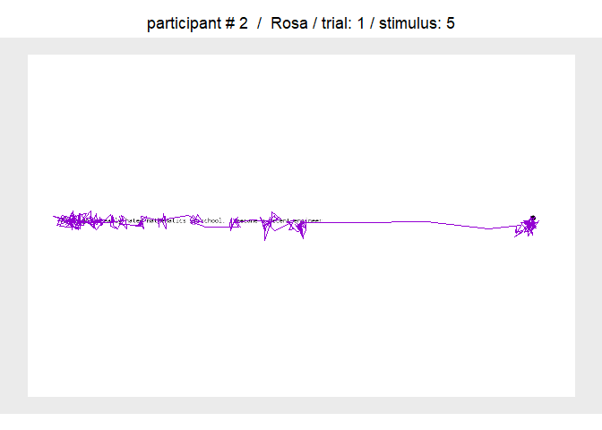
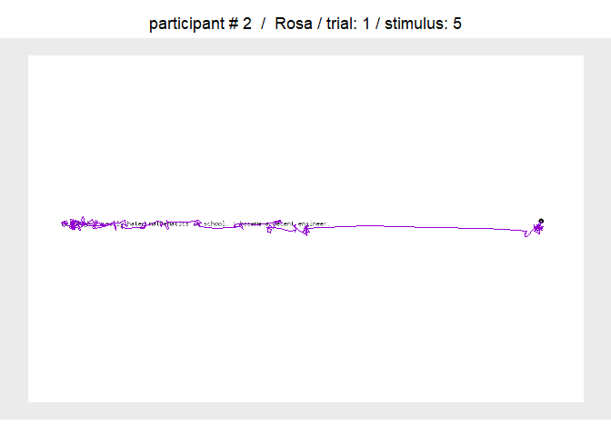
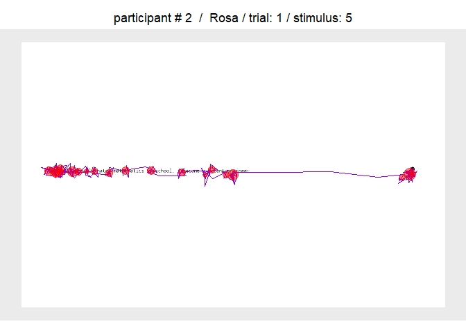
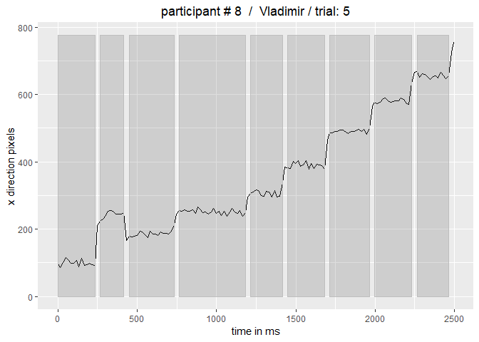
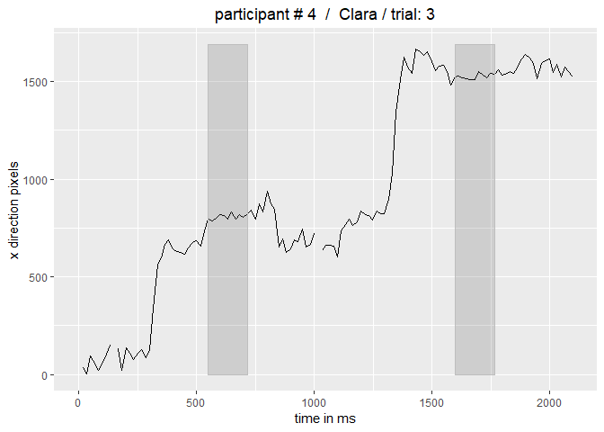
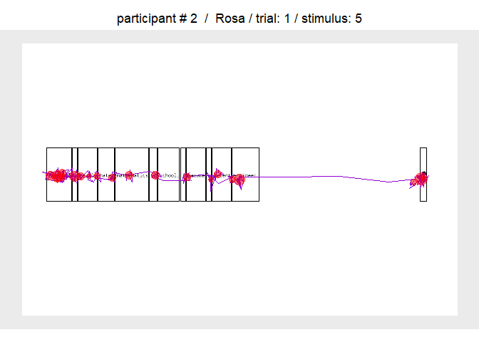

eyEdu Example Script: Reading Experiment
================

### Introduction

This is a short version of an example script on how eyEdu might be used for processing eye movement data recorded with an EyeTribe eye-tracker in a single sentence reading experiment (using OpenSesame and pygaze).

### Installing eyEdu on your machine

eyEdu is not on CRAN, but the development version can be installed from GitHub using the devtools package. To set up eyEdu, copy this bit of code and run in in R Studio:

``` r
  if (!require("devtools")) {
  install.packages("devtools", dependencies = TRUE)}
  devtools::install_github("SebastianKorinth/eyEdu") 
```

``` r
   library(eyEdu)
```

### Getting the reading experiment example data

The function EyEduGetExamples() will download a zip-file from github containing example data files - and the openSesame-experiment used to collect these data. The file will be unzipped and saved in the current working directory. So make sure it is properly set.

``` r
EyEduGetExamples(experiment.type = "reading")
```

### Setting the path to eye movement data

For some eyEdu functions we have to define the parameter "raw.data.path", which is the path, where raw data were stored. For the example reading experiment (downloaded into your current working directory before) you can define this with:

``` r
raw.data.path <- paste(getwd(),"/exampleDataReadingExperiment-master/", sep = "")
```

Potential pitfall: Make sure the path ends with a forward slash!
Potential pitfall: Check that you use forward slashes (Windows issue)!

### Importing raw eye movement data into eyEdu format

EyEduImportEyetribeData() reads raw data (.tsv files), separates eye movement from message information, extracts relevant information (e.g., screen dimensions, sample rate etc.), and saves these data for all participants into one structured file called eyEdu\_data.Rda within the raw data folder.
In this example, eight participants read ten single line sentences and responded afterwards to comprehension questions.

Since we are not interested in eye movements associated with question processing, we will segment each trial into periods of interest (poi), that are limited by the messages "start trail" (= default, not explicitly parsed to the function) until "response\_time\_key\_finish\_reading".

``` r
EyEduImportEyetribeData(poi.end = "response_time_key_finish_reading")
```

    ## [1] "Importing file: Clara.tsv - number 1 out of 8"
    ## [1] "Importing file: Ernst.tsv - number 2 out of 8"
    ## [1] "Importing file: Friedrich.tsv - number 3 out of 8"
    ## [1] "Importing file: Karl.tsv - number 4 out of 8"
    ## [1] "Importing file: Katja.tsv - number 5 out of 8"
    ## [1] "Importing file: Rosa.tsv - number 6 out of 8"
    ## [1] "Importing file: Sahra.tsv - number 7 out of 8"
    ## [1] "Importing file: Vladimir.tsv - number 8 out of 8"

    ## [1] "Done!"

Alternatively, there is a function that reads data recorded with a GazePoint eye-tracker called EyEduImportGazepointData().

``` r
EyEduImportGazepointData(poi.end = "response_time_key_finish_reading")
```

### Visualizing single trials

Now that we have our raw data in the eyEdu format, we can plot the raw data of single trials using the function EyEduPlotTrial().
The minimum requirement for this function is that we have to define for which participant (either name or number) and which trial number we would like to get a plot. There are several other parameters we can set for the function (e.g., color of samples for the left and right eye etc.). Note, the function will always try to superimpose eye movement data onto a screenshot of the stimulus participants saw during that time.

``` r
EyEduPlotTrial(participant.name = "Rosa", 
               trial.nr = 1)
```



### Low-pass filter

In order to reduce "high frequency noise" - funny expression for EyeTribe data recorded at a 60 Hz sample rate - you might want to apply a low pass filter using the function EyEduLowPassFilter(). The default setting is a moving average over three samples (filter.settings = rep(1/3, 3)), which however we can adjust if necessary.

``` r
EyEduLowPassFilter()
```

    ## [1] "Low-pass filtering:  Clara.tsv - number 1 out of 8"
    ## [1] "Low-pass filtering:  Ernst.tsv - number 2 out of 8"
    ## [1] "Low-pass filtering:  Friedrich.tsv - number 3 out of 8"
    ## [1] "Low-pass filtering:  Karl.tsv - number 4 out of 8"
    ## [1] "Low-pass filtering:  Katja.tsv - number 5 out of 8"
    ## [1] "Low-pass filtering:  Rosa.tsv - number 6 out of 8"
    ## [1] "Low-pass filtering:  Sahra.tsv - number 7 out of 8"
    ## [1] "Low-pass filtering:  Vladimir.tsv - number 8 out of 8"

Compare the plot above for the same participant and trial, this time plotting the filtered data (i.e., parameter show.filtered set to TRUE); data look "smoother".

``` r
EyEduPlotTrial(participant.name = "Rosa", 
               trial.nr = 1,
               show.filtered = TRUE)
```



### Fixation detection

The function EyEduDetectFixationsIDT() uses the emov library by Simon Schwab and its I-DT algorithm (Salvucci & Goldberg, 2000), which uses dispersion limits at a minimum time periode to distinguish between fixations and saccades. We can parse the option to run fixation detection on raw or on filtered data.

``` r
EyEduDetectFixationsIDT(dispersion.var = 90,duration.var = 6,use.filtered = F)
```

    ## [1] "Fixation detection for: Clara.tsv - number 1 out of 8"
    ## [1] "Fixation detection for: Ernst.tsv - number 2 out of 8"
    ## [1] "Fixation detection for: Friedrich.tsv - number 3 out of 8"
    ## [1] "Fixation detection for: Karl.tsv - number 4 out of 8"
    ## [1] "Fixation detection for: Katja.tsv - number 5 out of 8"
    ## [1] "Fixation detection for: Rosa.tsv - number 6 out of 8"
    ## [1] "Fixation detection for: Sahra.tsv - number 7 out of 8"
    ## [1] "Fixation detection for: Vladimir.tsv - number 8 out of 8"

    ## [1] "Done!"

Using the exact same code as above, we will have automatically added fixations to our trial plot.

``` r
EyEduPlotTrial(participant.name = "Rosa", 
               trial.nr = 1)
```



### Diagnostic plot

A convenient way to visually inspect whether fixation detection led to meaningful results is - at least for reading experiments, in which the primary movement direction would be on a horizontal line - to plot the x-position of raw data samples (black line) over a short period of time (e.g., 2500 ms) superimposed by grey shaded areas indicating periods defined as fixations.
In the example below we can see that fixation detection worked quite well.

``` r
EyEduPlotDiagnostics(participant.name = "Vladimir",trial.nr = 5,sample.length = 2500, show.filtered = F)
```



Here an example in which fixation detection was less successful.

``` r
EyEduPlotDiagnostics(participant.name = "Clara",
                     trial.nr = 3,
                     sample.length = 2500, 
                     show.filtered = F)
```



### Areas of interest (aoi) around single words

The following is meaningful for reading experiments only:
The EyEduDefineWordAois() function parses screenshots made during the reading experiments defines areas of interest around single words. Several parameters can be adjusted here to account for differences such as font size.

``` r
EyEduDefineWordAois(line.margin = 90,sparse.aoi.definition = T)
```

    ## [1] "Segmenting image: 1_0_2.png - number: 1 out of 10"
    ## [1] "Segmenting image: 1_1_9.png - number: 2 out of 10"
    ## [1] "Segmenting image: 1_2_5.png - number: 3 out of 10"
    ## [1] "Segmenting image: 1_3_7.png - number: 4 out of 10"
    ## [1] "Segmenting image: 1_4_4.png - number: 5 out of 10"
    ## [1] "Segmenting image: 1_5_6.png - number: 6 out of 10"
    ## [1] "Segmenting image: 1_6_8.png - number: 7 out of 10"
    ## [1] "Segmenting image: 1_7_3.png - number: 8 out of 10"
    ## [1] "Segmenting image: 1_8_10.png - number: 9 out of 10"
    ## [1] "Segmenting image: 1_9_1.png - number: 10 out of 10"
    ## [1] "Done!"

Using the EyEduPlotTrial() function, we will have automatically added the aoi info to our trial plot.

``` r
EyEduPlotTrial(participant.name = "Rosa", 
               trial.nr = 1,
               sparse.aoi.definition = T,
               aoi.names.screenshot = T)
```



### Get labels for areas of interest

The OpenSesame experiment comprises messages about which sentence a participant read in which trial. The single words of each sentence can easily be allocated to each area of interest. An extra aoi is added in our case standing for a fixation point at the right midline of the screen, which participants had to fixate whenever they have finished reading a sentence.

``` r
EyEduImportWordAoiLabels(extra.aoi = c("fixation_point"), sparse.aoi.definition = T)
```

### Assigning fixations to areas of interest

Now that we have prepared our areas of interest (including labels) we can assign each fixation to an aoi. Of course, some fixations will fall outside of aois.

``` r
EyEduAssignFixationsAois(sparse.aoi.definition = T,aoi.names.screenshot = T)
```

    ## [1] "Assigning fixations to AoIs for participant:  Clara.tsv - number 1 out of 8"
    ## [1] "Assigning fixations to AoIs for participant:  Ernst.tsv - number 2 out of 8"
    ## [1] "Assigning fixations to AoIs for participant:  Friedrich.tsv - number 3 out of 8"
    ## [1] "Assigning fixations to AoIs for participant:  Karl.tsv - number 4 out of 8"
    ## [1] "Assigning fixations to AoIs for participant:  Katja.tsv - number 5 out of 8"
    ## [1] "Assigning fixations to AoIs for participant:  Rosa.tsv - number 6 out of 8"
    ## [1] "Assigning fixations to AoIs for participant:  Sahra.tsv - number 7 out of 8"
    ## [1] "Assigning fixations to AoIs for participant:  Vladimir.tsv - number 8 out of 8"

    ## [1] "Done!"

So we get the information, whether at all, for how long, and how often each participant fixated each word.

``` r
load("exampleDataReadingExperiment-master/eyEdu_data.Rda")
head(eyEdu.data$participants$Karl.tsv$fixation.data[,c(3,4,5,11)])
```

    ##   fix.duration fix.pos.x fix.pos.y   aoi.label
    ## 1          250  119.7736  524.3366    Although
    ## 2          217  227.6361  527.7616      really
    ## 3          266  295.5726  522.1813       hated
    ## 4          150  352.1758  528.2623       hated
    ## 5          183  381.5681  527.9833 mathematics
    ## 6          266  508.7757  515.2926          in

### Fixation summary

The function EyEduGetFixationSummary() collects the fixation information of all participants and saves it into one data frame (fixation\_summary.Rda within the raw data folder). We can use this for further statistical analyses (e.g., testing whether longer words received more fixations etc.).

``` r
EyEduGetFixationSummary()
load("exampleDataReadingExperiment-master/fixation_summary.Rda")
fixation.summary[100:109,]
```

    ##     fix.start   fix.end fix.duration fix.pos.x fix.pos.y fixation.index
    ## 100 134980464 134980597          133  143.3897  477.6628              2
    ## 101 134980630 134980780          150  206.2581  515.0545              3
    ## 102 134980813 134981013          200  267.7667  537.0108              4
    ## 103 134981046 134981246          200  338.1058  547.6446              5
    ## 104 134981279 134981429          150  391.8592  546.2600              6
    ## 105 134981462 134981696          234  453.0172  541.4008              7
    ## 106 134981729 134982112          383  566.6391  542.2754              8
    ## 107 134982145 134982411          266  687.8410  540.1382              9
    ## 108 134982445 134982611          166  771.7422  531.7117             10
    ## 109 134982645 134982844          199  837.5969  519.4043             11
    ##     trial.index stimulus.id aoi.index aoi.line.index   aoi.label
    ## 100           3           5         1              1    Although
    ## 101           3           5         2              1           I
    ## 102           3           5         3              1      really
    ## 103           3           5         4              1       hated
    ## 104           3           5         5              1 mathematics
    ## 105           3           5         5              1 mathematics
    ## 106           3           5         7              1     school,
    ## 107           3           5         9              1      became
    ## 108           3           5        11              1      decent
    ## 109           3           5        12              1   engineer.
    ##     participant.name participant.nr
    ## 100            Ernst              1
    ## 101            Ernst              1
    ## 102            Ernst              1
    ## 103            Ernst              1
    ## 104            Ernst              1
    ## 105            Ernst              1
    ## 106            Ernst              1
    ## 107            Ernst              1
    ## 108            Ernst              1
    ## 109            Ernst              1
